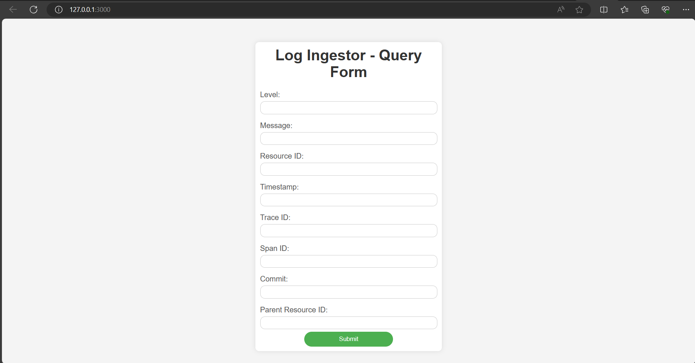
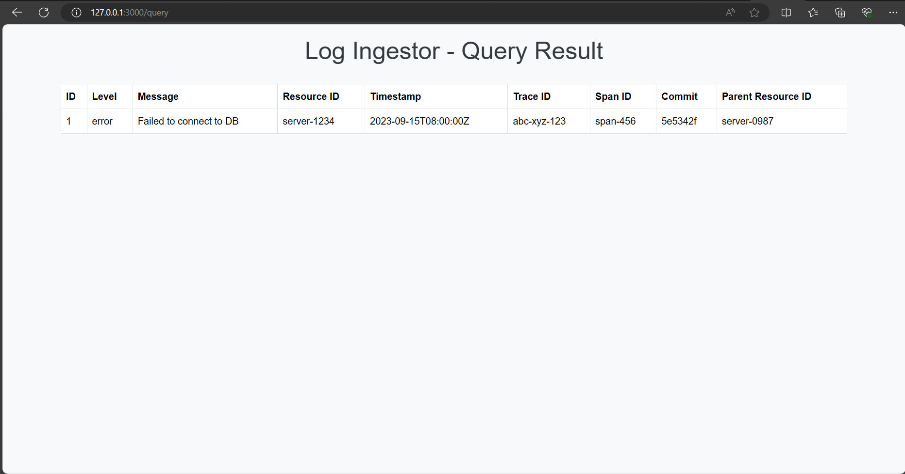

<!-- Improved compatibility of back to top link: See: https://github.com/othneildrew/Best-README-Template/pull/73 -->
<a name="readme-top"></a>
<h1>Log Ingestor</h1>


<!-- PROJECT LOGO -->
<br />
<div align="center">
  <a href="https://github.com/github_username/repo_name">
    
  </a>

<h3 align="center">Log Ingestor</h3>

  <p align="center">
    The project is a log ingestor that helps you ingest logs and query it.
    <br />

</div>


<!-- TABLE OF CONTENTS -->
<details>
  <summary>Table of Contents</summary>
  <ol>
    <li>
      <a href="#about-the-project">About The Project</a>
      <ul>
        <li><a href="#built-with">Built With</a></li>
      </ul>
    </li>
    <li>
      <a href="#getting-started">Getting Started</a>
      <ul>
        <li><a href="#prerequisites">Prerequisites</a></li>
      </ul>
    </li>
    <li><a href="#usage">Usage</a></li>
    <li><a href="#contributing">Contributing</a></li>
    <li><a href="#license">License</a></li>
  </ol>
</details>


<!-- ABOUT THE PROJECT -->
## About The Project

The project is built on `Flask`. It helps you ingest logs and then later query it. It consists of app.py. On running app.py the server will run on localhost on port 3000. On launching the localhost with port 3000 a query_form will be visible in your browser.
<br>
<div align="center">

</div>
<br>
<br>
On enterring query in the input boxes if a query is matched then the logs are shown in query_result webpage.
<br>
<div align="center">

</div>


<p align="right">(<a href="#readme-top">back to top</a>)</p>


### Built With

`Flask`<br>
`MySQL`<br>
`HTML`<br>

<p align="right">(<a href="#readme-top">back to top</a>)</p>


<!-- GETTING STARTED -->
## Getting Started

This is an example of how you may give instructions on setting up your project locally.
To get a local copy up and running follow these simple example steps.

### Prerequisites

This is an example of how to list things you need to use the software and how to install them.
* pip
  ```sh
  pip install flask
  ```
  ```sh
  pip install mysql-connector-python
  ```


<p align="right">(<a href="#readme-top">back to top</a>)</p>


<!-- USAGE EXAMPLES -->
## Usage

Save `app.py` and `templates` in a folder. 
* run in terminal where you have saved the file.
  ```sh
  python app.py
  ```
A new database is created(if not present) with the name logs. To see if the database is created open mysql command line client and run
  ```sh
  show databases;
  ```
A table with name logs is created in the same database. To check if the table is created successfully run
  ```sh
  show tables;
  ```
To add logs to the table use - 
* windows
  ```sh
  $headers = @{
    "Content-Type" = "application/json"}
  $data = @{
    "level" = "error"
    "message" = "Failed to connect to DB"
    "resourceId" = "server-1234"
    "timestamp" = "2023-09-15T08:00:00Z"
    "traceId" = "abc-xyz-123"
    "spanId" = "span-456"
    "commit" = "5e5342f"
    "metadata" = @{
        "parentResourceId" = "server-0987"
    }
  }

  Invoke-RestMethod -Uri "http://localhost:3000/logs" -Method Post -Headers $headers -Body ($data | ConvertTo-Json)

  ```
  *Linux
  ```sh
  curl -X POST -H "Content-Type: application/json" -d '{
    "level": "error",
    "message": "Failed to connect to DB",
    "resourceId": "server-1234",
    "timestamp": "2023-09-15T08:00:00Z",
    "traceId": "abc-xyz-123",
    "spanId": "span-456",
    "commit": "5e5342f",
    "metadata": {
        "parentResourceId": "server-0987"
    }
  }' http://localhost:3000/logs

  ```
  
  


<p align="right">(<a href="#readme-top">back to top</a>)</p>


<!-- CONTRIBUTING -->
## Contributing

Contributions are what make the open source community such an amazing place to learn, inspire, and create. Any contributions you make are **greatly appreciated**.

If you have a suggestion that would make this better, please fork the repo and create a pull request. You can also simply open an issue with the tag "enhancement".
Don't forget to give the project a star! Thanks again!


<p align="right">(<a href="#readme-top">back to top</a>)</p>


<!-- LICENSE -->
## License

Distributed under the MIT License. See `LICENSE.txt` for more information.

<p align="right">(<a href="#readme-top">back to top</a>)</p>


